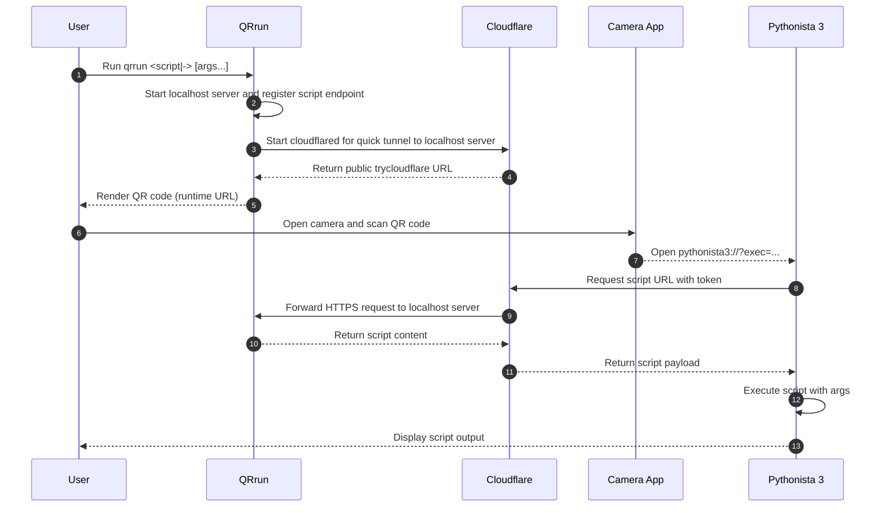

# QRrun

[](https://github.com/sakurai-youhei/qrrun/actions/workflows/ci.yml)
[](https://github.com/sakurai-youhei/qrrun/security/code-scanning)
[](https://github.com/sakurai-youhei/qrrun/releases)
[](LICENSE)

Prototype on your machine. Run on your phone in one scan.

**What problem does this solve?** Phones are powerful, connected, and have excellent runtimes (e.g. [Pythonista 3](https://apps.apple.com/app/pythonista-3/id1085978097)), but writing code on-device is awkward compared with your editor, VCS, and stack on a laptop. Getting a script to the phone often means cloud storage, a gist, AirDrop, or other handoffs that slow a quick “does this run?” moment.

A QR can carry a few kilobytes, without a direct network between the devices. A larger script uses that as a bootstrap: the phone pulls the real payload from your computer through a [secure tunnel](https://developers.cloudflare.com/cloudflare-one/networks/connectors/cloudflare-tunnel/do-more-with-tunnels/trycloudflare/), so the printed image stays a small, scannable token.

**What QRrun is for:** keep authoring where you always do, print a code to run the same script in a supported on-phone runtime, and graduate to a proper distribution when the idea matures. QRrun also defends the path it controls—TLS, unguessable paths and tokens, and E2E tests that verify the script your phone receives is the one you meant to serve.


## Prerequisites

- `cloudflared` must be installed and available in your PATH.
- QRrun uses Cloudflare Quick Tunnels (`trycloudflare.com`). See [Cloudflare Quick Tunnel documentation](https://developers.cloudflare.com/cloudflare-one/networks/connectors/cloudflare-tunnel/do-more-with-tunnels/trycloudflare/) for details.
- Install [Pythonista 3](https://apps.apple.com/app/pythonista-3/id1085978097) and/or [a-Shell](https://apps.apple.com/app/a-shell/id1473805438) on your smartphone in advance.

## Usage

Run with a local file:

```bash
qrrun hello.py arg1 arg2
```

Run from stdin (`-`):

```bash
echo 'print("Hello, QRrun!")' | qrrun - arg1 arg2
```

By default, QRrun generates a QR code for opening and running your Python 3 script in [Pythonista 3](https://apps.apple.com/app/pythonista-3/id1085978097); use `--runtime` to override this behavior.
For more options and behavior details, run `qrrun --help`:

```text
QRrun serves a local script through a secure tunnel and prints a QR code.

scan the QR code to open the script in the selected runtime.

Prerequisites:
	cloudflared must be installed and available on PATH
	QRrun uses Cloudflare Quick Tunnels (trycloudflare.com)

Examples:
	qrrun hello.py arg1 arg2
	echo 'print("Hello, QRrun!")' | qrrun - arg1 arg2

Usage:
  qrrun [flags] <script|-> [args...]

Flags:
      --debug                   show debug logs
  -h, --help                    help for qrrun
      --keep-serving            keep serving requests until interrupted
      --print-url               print only the runtime URL
      --qr-level string         error correction level L/M/Q/H (default "M")
      --quiet-period duration   quiet period before exit (default 500ms)
      --runtime string          target runtime (default "pythonista3")
      --transport string        tunnel transport (default "cloudflared")
      --transport-opts string   extra args for the transport command
      --transport-stderr        show transport stderr on console
      --transport-stdout        show transport stdout on console
  -v, --version                 version for qrrun

Supported runtimes:
	ashell        Shell (sh) script
	pythonista2   Python 2 script
	pythonista3   Python 3 script
```

## Installation

See [INSTALL.md](INSTALL.md).

## Development Setup

1. Install [mise](https://mise.jdx.dev/):
2. Trust `mise.toml` (one-time setup):

```bash
mise trust mise.toml
```

3. Install pre-commit hooks (highly recommended):

```bash
pre-commit install
```

4. Run the end-to-end test:

```bash
make test-e2e
```

## Execution Flow


