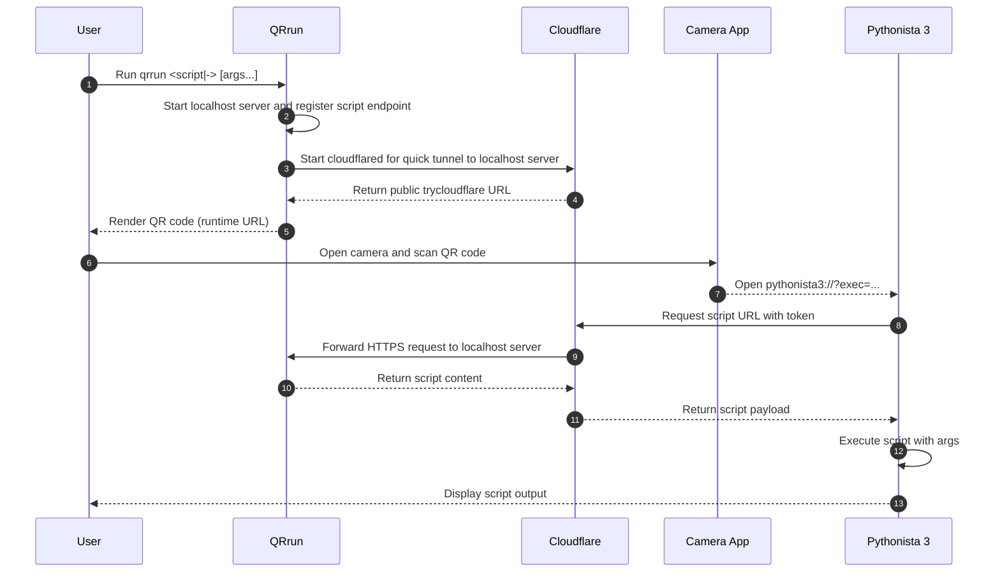

# QRrun

[](https://github.com/sakurai-youhei/qrrun/actions/workflows/ci.yml)
[](https://github.com/sakurai-youhei/qrrun/security/code-scanning)
[](https://github.com/sakurai-youhei/qrrun/releases)
[](LICENSE)

Tunnel local code. Run via QR.


## Prerequisites

- `cloudflared` must be installed and available in your PATH.
- QRrun uses Cloudflare Quick Tunnels (`trycloudflare.com`). See [Cloudflare Quick Tunnel documentation](https://developers.cloudflare.com/cloudflare-one/networks/connectors/cloudflare-tunnel/do-more-with-tunnels/trycloudflare/) for details.

## Usage

Run with a local file:

```bash
qrrun hello.py arg1 arg2
```

Run from stdin (`-`):

```bash
echo 'print("Hello, QRrun!")' | qrrun - arg1 arg2
```

By default, QRrun generates a QR code for opening and running your script in [Pythonista 3](https://apps.apple.com/app/pythonista-3/id1085978097); use `--runtime` to override this behavior.
For more options and behavior details, run `qrrun --help`.

## Installation

See [INSTALL.md](INSTALL.md).

## Development Setup

1. Install [mise](https://mise.jdx.dev/):
2. Trust `mise.toml` (one-time setup):

```bash
mise trust mise.toml
```

3. Install pre-commit hooks (highly recommended):

```bash
pre-commit install
```

4. Run the end-to-end test:

```bash
make test-e2e
```

## Execution Flow


